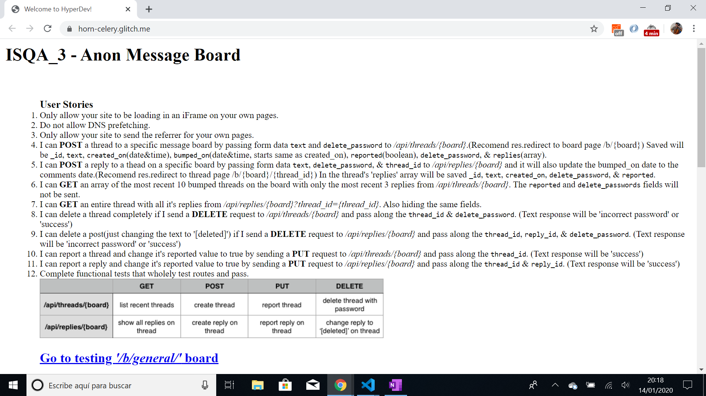

# :zap: FCC Anon Message Board

* Free Code Camp project to post, get and delete messages using Node.js and express + mongoDB

*** Note: to open web links in a new window use: _ctrl+click on link_**

## :page_facing_up: Table of contents

* [:zap: FCC Anon Message Board](#zap-fcc-anon-message-board)
  * [:page_facing_up: Table of contents](#page_facing_up-table-of-contents)
  * [:books: General info](#books-general-info)
  * [:camera: Screenshots](#camera-screenshots)
  * [:signal_strength: Technologies](#signal_strength-technologies)
  * [:floppy_disk: Setup](#floppy_disk-setup)
  * [:computer: Code Examples](#computer-code-examples)
  * [:cool: Features - FCC Requirements](#cool-features---fcc-requirements)
  * [:clipboard: Status & To-Do List](#clipboard-status--to-do-list)
  * [:clap: Inspiration](#clap-inspiration)
  * [:envelope: Contact](#envelope-contact)

## :books: General info

* Code had to be functionally similar to [this](https://horn-celery.glitch.me/).
* SET NODE_ENV to `test` without quotes when ready to write tests and DB to your databases connection string (in .env)
* Recomended to create controllers/handlers and handle routing in routes/api.js
* You will add any security features to `server.js`
* You will create all of the functional/unit tests in `tests/2_functional-tests.js` and `tests/1_unit-tests.js` but only functional will be tested

## :camera: Screenshots

.

## :signal_strength: Technologies

* [Express.js v4](https://expressjs.com/) web framework for Node.js
* [Cors v2](https://www.npmjs.com/package/cors) node.js package to enable Cross Origin Resource Sharing (CORS)
* [Body-parser v1](https://www.npmjs.com/package/body-parser) node.js parsing middleware
* [Chai v4](https://www.chaijs.com/) assertion library for node
* [MongoDB v3](https://www.mongodb.com/)
* [Chai-http v4](https://www.chaijs.com/plugins/chai-http/) http integration testing with Chai assertions.
* [Mocha v8](https://mochajs.org/) javascript test framework that runs on Node.js
* [Zombie v6](https://www.npmjs.com/package/zombie) headless full-stack testing
* [Helmet v3](https://www.npmjs.com/package/helmet) to set HTTP headers
* [Mongoose v5](https://mongoosejs.com/) mongodb object modelling for node.js

## :floppy_disk: Setup

* Add .env file with MongoDB database DB, PORT for file `api.js`
* run `nom start` for a dev server
* View in [Glitch](https://anon-message-board.glitch.me/).

## :computer: Code Examples

* function to show board data (minus reported and delete_password fields, with latest 3 replies)

```javascript
  const showAll = (board, res) => {
    board.find({}, {reported: 0, delete_password: 0, replies: {$slice: -3} })
      .sort({bumped_on: -1}) //sort by most recent first
      .limit( 10 ) //limit no of results to 10
      .exec((err, data) => {
        if (err) return res.send(err.message)
        res.json(data)
      })
  }
```

## :cool: Features - FCC Requirements

* Only allow your site to be loading in an iFrame on your own pages.
* Do not allow DNS prefetching.
* Only allow your site to send the referrer for your own pages.
* I can POST a thread to a specific message board by passing form data text and deletepassword**_ to /api/threads/{board}.(Recommend res.redirect to board page /b/{board}) Saved will be at least _**id, text, createdon_(date&time), bumpedon_(date&time, starts same as created_on), reported(boolean), deletepassword_, & replies(array).
* I can POST a reply to a thread on a specific board by passing form data text, deletepassword_, & threadid_ to /api/replies/{board} and it will also update the bumped_on date to the comments date.(Recommend res.redirect to thread page /b/{board}/{thread_id}) In the thread's replies array will be saved _id, text, createdon_, deletepassword_, & reported.
* I can GET an array of the most recent 10 bumped threads on the board with only the most recent 3 replies each from /api/threads/{board}. The reported and deletepasswords_ fields will not be sent to the client.
* I can GET an entire thread with all its replies from /api/replies/{board}?thread_id={thread_id}. Also hiding the same fields the client should be see.
* I can delete a thread completely if I send a DELETE request to /api/threads/{board} and pass along the threadid**_ & deletepassword_**. (Text response will be 'incorrect password' or 'success')
* I can delete a post(just changing the text to '[deleted]' instead of removing completely like a thread) if I send a DELETE request to /api/replies/{board} and pass along the threadid_, replyid_, & deletepassword_. (Text response will be 'incorrect password' or 'success')
* I can report a thread and change its reported value to true by sending a PUT request to /api/threads/{board} and pass along the threadid_. (Text response will be 'success')
* I can report a reply and change its reported value to true by sending a PUT request to /api/replies/{board} and pass along the threadid**_ & replyid_**. (Text response will be 'success')
* Complete functional tests that wholly test routes and pass.

## :clipboard: Status & To-Do List

* Status: Working.
* To-Do: complete documentation of code.

## :clap: Inspiration

* FreeCodeCamp: [Information Security and Quality Assurance Projects - Anonymous Message Board](https://www.freecodecamp.org/learn/information-security-and-quality-assurance/information-security-and-quality-assurance-projects/anonymous-message-board).
* [TutorialsPoint article: ExpressJS - Middleware](https://www.tutorialspoint.com/expressjs/expressjs_middleware.htm)

## :envelope: Contact

* Repo created by [ABateman](https://www.andrewbateman.org) - you are welcome to [send me a message](https://andrewbateman.org/contact)
